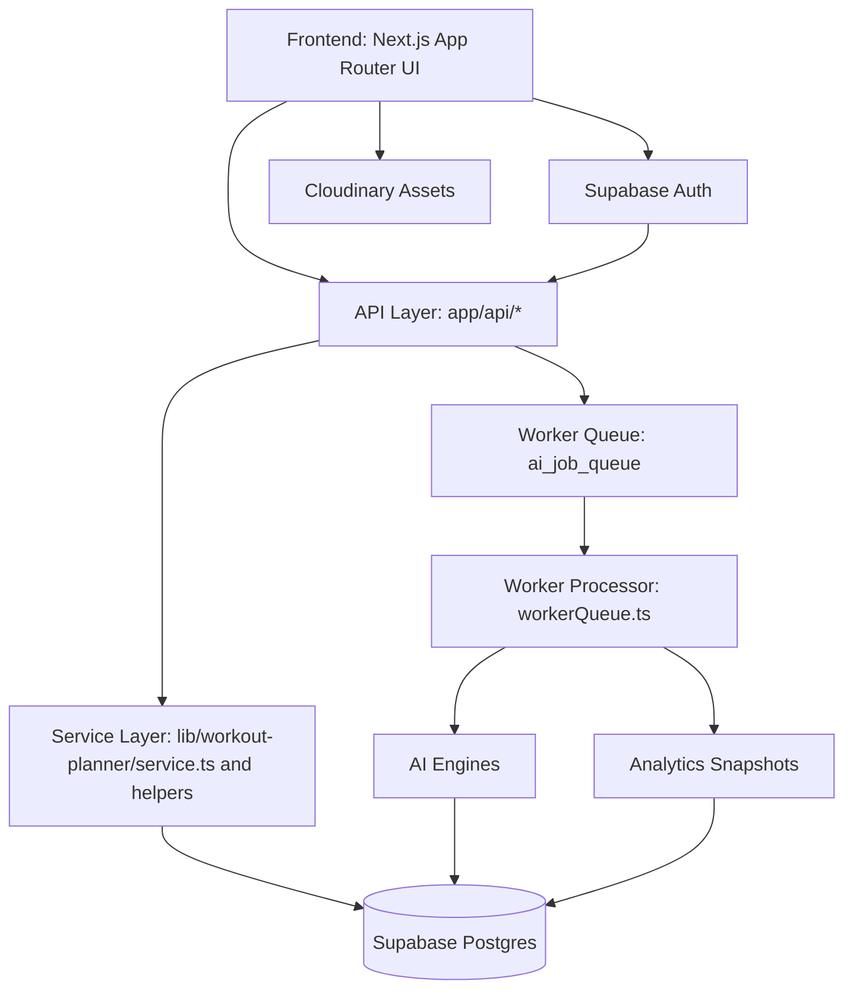
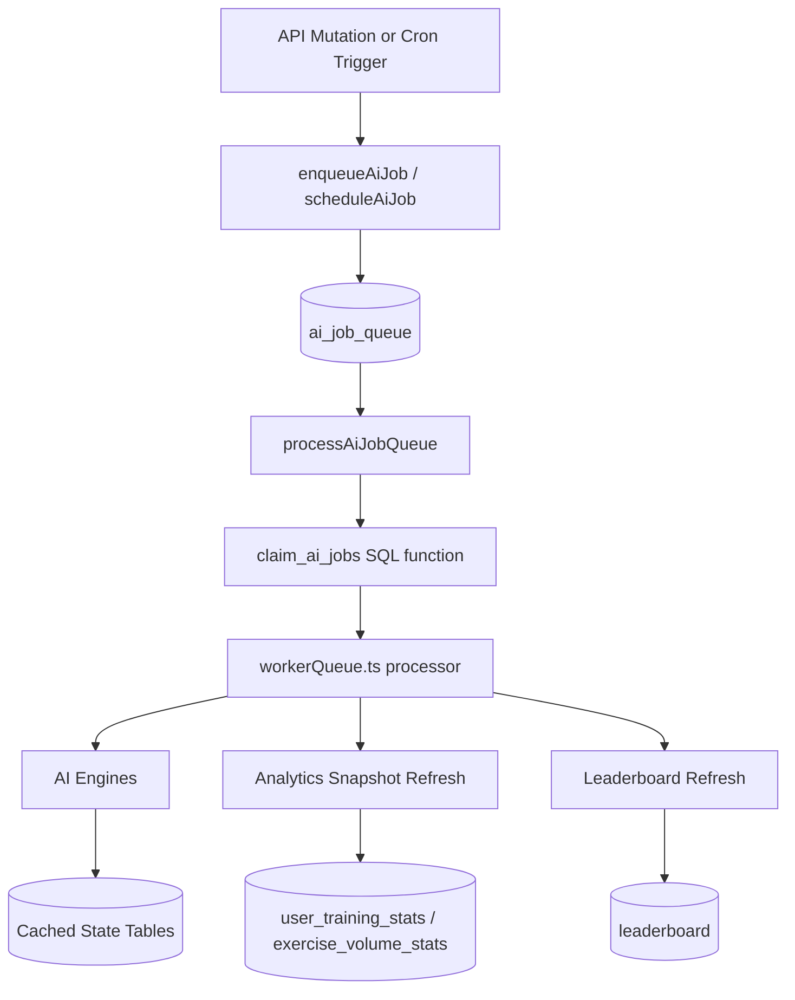
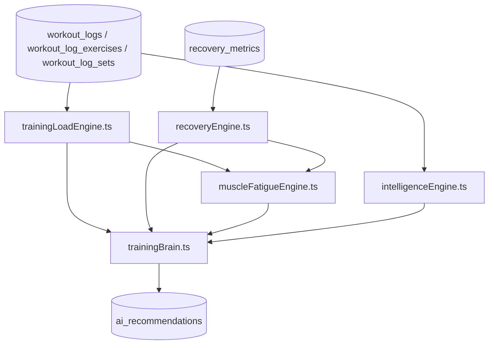
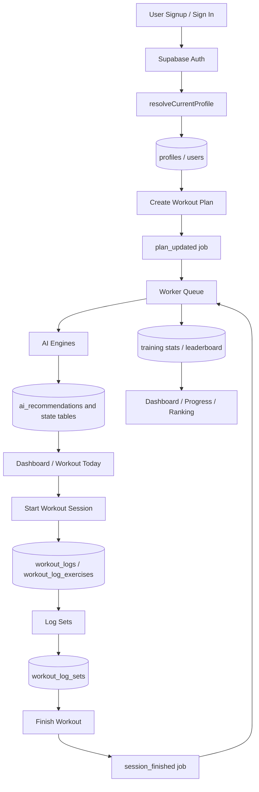

# BioLift System Architecture Blueprint

## 1. System Overview

BioLift is a Next.js fitness platform that combines:

- a client-rendered dashboard application,
- authenticated API routes,
- a Supabase-backed relational data model,
- a database-backed worker queue, and
- adaptive training intelligence engines that run asynchronously.

The production architecture is intentionally split between request-time reads and background computation:

- user-facing APIs return cached or pre-aggregated results,
- expensive AI and analytics workloads run through the worker queue,
- Supabase Postgres is the system of record for plans, logs, AI state, and analytics,
- authentication and authorization flow through Supabase Auth plus database-backed profile records.

This document describes only modules that exist in the current repository. Where the requested module name does not exist, the nearest implemented equivalent is identified explicitly.

## 2. High-Level Component Map

### 2.1 Major Layers

| Layer | Primary implementation | Responsibility |
| --- | --- | --- |
| Frontend | `app/*`, `components/*` | Dashboard UI, workout session UI, planner UI, analytics views, profile and leaderboard pages |
| Client state and auth | `app/providers.tsx`, `lib/auth/AuthContext.tsx`, `lib/theme/ThemeContext.tsx` | Session state, theme state, authenticated browser access |
| API layer | `app/api/*` | Authenticated JSON endpoints for dashboard, workouts, planner flows, progress, rankings, admin, and worker triggers |
| Service layer | `lib/workout-planner/service.ts`, `smartPlanner.ts`, `validation.ts`, `apiContext.ts` | Domain orchestration, validation, database access, cache reads, aggregated responses |
| AI engine layer | `lib/workout-planner/intelligenceEngine.ts`, `trainingBrain.ts`, `recoveryEngine.ts`, `trainingLoadEngine.ts`, `muscleFatigueEngine.ts` | Adaptive recommendation logic and physiological state modeling |
| Worker system | `lib/workout-planner/workerQueue.ts`, `app/api/cron/*`, `app/api/internal/ai-worker/process/route.ts` | Asynchronous job processing, retries, stale-job recovery, analytics refresh |
| Data layer | `database/*`, Supabase Postgres | Transactional training data, cached AI outputs, analytics snapshots, queue state, auth-linked profile data |
| External integrations | Supabase, Cloudinary, Vercel cron | Auth, Postgres, asset hosting, scheduled worker triggers |

### 2.2 High-Level Architecture Diagram



## 3. Frontend Architecture

### 3.1 Application Shell

The frontend is built with the Next.js App Router.

- `app/layout.tsx` defines the root layout, metadata, fonts, and PWA registration.
- `app/providers.tsx` wires the global providers.
- `app/dashboard/layout.tsx` wraps authenticated dashboard pages with the dashboard shell.
- `app/admin/layout.tsx` wraps admin-only pages with `AdminShell`.
- `proxy.ts` enforces route-level redirects for authenticated, unauthenticated, and admin-only navigation.

### 3.2 State Management Pattern

BioLift does not use a global client data cache such as React Query, SWR, Redux, or Zustand.

The current pattern is:

- auth state from `lib/auth/AuthContext.tsx`,
- theme state from `lib/theme/ThemeContext.tsx`,
- page-local state using React hooks,
- direct `fetch()` calls from client components,
- API responses loaded with `cache: "no-store"` where freshness is required.

This means the frontend architecture is thin: most domain logic lives in API routes and service modules, not in client state containers.

### 3.3 Major UI Modules

| UI module | Main entry points | Notes |
| --- | --- | --- |
| Dashboard | `app/dashboard/page.tsx` | Loads summary cards, workout preview, ranking preview, progress indicators, and AI coaching surfaces |
| Workout session | `app/dashboard/workout-session/page.tsx` | Executes the active day workout, logs sets, and finishes sessions |
| Workout planner | `app/dashboard/workout-planner/page.tsx` | Generates, edits, and inspects workout plans |
| Workout builder / workouts | `app/dashboard/workouts/page.tsx` | Lists or manages workout-related data around plans and sessions |
| Progress analytics | `app/dashboard/progress/page.tsx` | Displays training history, charts, body-weight tracking, and aggregated stats |
| Leaderboard | `app/dashboard/ranking/page.tsx` | Shows ranking and leaderboard data |
| Profile | `app/dashboard/profile/page.tsx` | Shows account and user profile information |
| AI coaching card | `components/ai/AICoachCard.tsx` | Reusable coaching and recommendation display surface |

### 3.4 Frontend Routing Notes

- `app/dashboard/workout/page.tsx` currently redirects to `/dashboard/workout-session`.
- `app/dashboard/social/page.tsx` and `app/dashboard/shop/page.tsx` exist, but corresponding header navigation is feature-flagged.
- `app/dashboard/diet/page.tsx` is marked `LEGACY`.

### 3.5 Frontend Data Fetching Pattern

The dominant data-fetching pattern is:

1. page mounts,
2. component fetches from a route under `app/api/*`,
3. route resolves the current user through Supabase Auth and profile helpers,
4. route calls a service function,
5. route returns a normalized JSON payload.

This keeps UI components relatively thin and makes the API layer the contract boundary between client rendering and domain logic.

## 4. API Layer

### 4.1 API Architecture Pattern

Most authenticated user routes share the same structure:

1. create a server Supabase client,
2. resolve the current profile,
3. apply route-specific rate limiting if configured,
4. validate request payload,
5. call service-layer functions,
6. return normalized JSON through shared response helpers.

The core request context helper is `lib/workout-planner/apiContext.ts`.

### 4.2 Route Groups

#### Authentication and identity

| Route | Responsibility | Downstream modules |
| --- | --- | --- |
| `app/auth/callback/route.ts` | Handles Supabase auth callback flow | Supabase server auth |
| `app/api/auth/sync-role/route.ts` | Synchronizes role/profile state after auth | `lib/auth/syncUserRole.ts`, Supabase clients |

#### Dashboard and profile

| Route | Responsibility | Downstream modules |
| --- | --- | --- |
| `app/api/dashboard/summary/route.ts` | Returns the dashboard summary payload | `service.ts` dashboard summary methods, recommendation cache reads |
| `app/api/dashboard/motivation/route.ts` | Legacy motivation endpoint | Marked legacy; not part of the core adaptive path |
| `app/api/profile/overview/route.ts` | Returns profile overview data | profile reads via service/context helpers |

#### Workout execution and planning

| Route | Responsibility | Downstream modules |
| --- | --- | --- |
| `app/api/workout/today/route.ts` | Returns the current workout and cached recommendations | `service.ts`, recommendation cache, job enqueue helpers |
| `app/api/workout/session/route.ts` | Starts or finishes a workout session and persists logs | `service.ts`, validation helpers, worker queue enqueue |
| `app/api/workout-planner/recommendations/route.ts` | Returns cached AI recommendations for the active plan/day | `service.ts`, queue enqueue on cache refresh request |
| `app/api/workout-planner/generate/route.ts` | Generates smart workout plans | `service.ts`, `smartPlanner.ts`, validation |
| `app/api/workout-planner/manual/route.ts` | Creates manual plans | `service.ts`, validation |
| `app/api/workout-planner/plans/route.ts` | Lists and creates plans | `service.ts` |
| `app/api/workout-planner/plans/[id]/route.ts` | Loads or updates a specific plan | `service.ts`, validation |
| `app/api/workout-planner/exercises/route.ts` | Searches exercises or creates custom exercises | `service.ts` |
| `app/api/workout-planner/calendar/route.ts` | Manages workout calendar completion state | `service.ts`, validation |
| `app/api/workout-planner/logs/route.ts` | Returns workout log data | `service.ts` |

#### Progress and recovery

| Route | Responsibility | Downstream modules |
| --- | --- | --- |
| `app/api/progress/overview/route.ts` | Returns aggregated progress analytics | `service.ts` |
| `app/api/progress/log-weight/route.ts` | Writes body-weight entries | `service.ts` |
| `app/api/progress/log-workout/route.ts` | Writes manual workout history entries | `service.ts`, worker enqueue |
| `app/api/recovery-metrics/route.ts` | Reads or writes recovery metrics | `service.ts`, worker enqueue |
| `app/api/injury-flags/route.ts` | Reads or writes injury constraints | service/context helpers, cached recommendation refresh triggers |

#### Ranking and admin

| Route | Responsibility | Downstream modules |
| --- | --- | --- |
| `app/api/ranking/overview/route.ts` | Returns leaderboard and ranking data | `service.ts`, leaderboard tables |
| `app/api/admin/overview/route.ts` | Admin summary metrics | `lib/admin/server.ts`, admin Supabase reads |
| `app/api/admin/queue/route.ts` | Admin view of queue health | `lib/admin/server.ts`, queue tables |
| `app/api/admin/users/route.ts` | Admin user management or inspection | `lib/admin/server.ts` |

#### Worker and scheduled processing

| Route | Responsibility | Downstream modules |
| --- | --- | --- |
| `app/api/cron/ai-worker/route.ts` | Scheduled worker trigger | `workerQueue.ts` |
| `app/api/cron/ai-refresh/route.ts` | Scheduled AI refresh trigger | `workerQueue.ts` |
| `app/api/internal/ai-worker/process/route.ts` | Internal authenticated worker execution endpoint | `workerQueue.ts`, worker secret validation |

### 4.3 Route-to-Service Observations

The request path split is consistent across the main product surface:

- dashboard routes aggregate cached state and lightweight summaries,
- workout routes manage relational workout execution data,
- planner routes create or mutate plans and then enqueue AI refresh work,
- progress and recovery routes persist new signals and enqueue downstream recomputation,
- ranking routes read leaderboard snapshots,
- cron and internal routes process the asynchronous queue with service-role access.

The key design choice is that recommendation generation is not intended to run inline in user-facing requests. User routes usually read from `ai_recommendations` and only enqueue refresh jobs when cache state is missing, stale, or approximate.

## 5. Service Layer

### 5.1 Core Orchestration Modules

The service layer is concentrated in `lib/workout-planner/*`.

| Module | Responsibility |
| --- | --- |
| `service.ts` | Main domain orchestration for plans, workouts, dashboard summaries, progress summaries, recommendation cache reads, ranking refresh, and analytics reads |
| `smartPlanner.ts` | Deterministic smart-plan generation based on goal, experience, and workout frequency |
| `validation.ts` | Request validation for planner inputs, manual plans, workout logs, and calendar mutations |
| `apiContext.ts` | Shared authenticated API context and route-scoped rate limiting |
| `types.ts` | Shared planner, workout, and catalog types |

### 5.2 `service.ts`

`service.ts` is the primary service boundary between the API layer and the database.

Its responsibilities include:

- smart plan creation through `generateSmartPlan`,
- manual plan creation through `createManualPlan`,
- plan listing, loading, status toggling, and exercise replacement,
- exercise catalog search and custom exercise creation,
- workout log creation and calendar status upsert,
- dashboard summary aggregation,
- progress overview aggregation,
- body-weight and manual-workout logging,
- leaderboard refresh and ranking overview reads,
- recommendation cache reads through `getWorkoutRecommendations`,
- recommendation cache generation through `primeWorkoutRecommendationCache`.

The recommendation path is intentionally split:

- `getWorkoutRecommendations` reads from `ai_recommendations`, falls back to the latest plan-level cache, and finally falls back to baseline plan rows.
- `primeWorkoutRecommendationCache` performs the expensive recommendation build by running `intelligenceEngine.ts` and then `trainingBrain.ts`, before writing the result back to `ai_recommendations`.

### 5.3 `trainingBrain.ts`

`trainingBrain.ts` is the second-stage adaptation layer.

It refines the first-pass recommendation result by incorporating:

- `exercise_adaptation_state`,
- recent exercise history,
- `recovery_state`,
- `training_load_state`,
- `muscle_fatigue_state`,
- injury flags and movement restrictions,
- plan exercise context and exercise catalog alternatives.

Its two major responsibilities are:

- `applyTrainingBrain`: modifies recommendation outputs before caching,
- `updateExerciseAdaptationState`: persists adaptation outcomes after a completed or manually logged session.

In practice, this is the module that can push recommendations toward `reduce`, `deload`, or `substitute`.

### 5.4 `recoveryEngine.ts`

`recoveryEngine.ts` computes `recovery_state`.

It uses recovery-related inputs such as:

- sleep,
- soreness,
- stress,
- energy,
- HRV and resting heart rate when available,
- recent training load.

The main responsibilities are:

- `recomputeRecoveryState`: recompute and persist the latest recovery model,
- `getRecoveryState`: read the latest cached recovery state.

### 5.5 `trainingLoadEngine.ts`

`trainingLoadEngine.ts` computes workload trend state in `training_load_state`.

Its model includes:

- acute load over 7 days,
- chronic load over 28 days,
- ACWR,
- fatigue trend,
- plateau risk,
- overtraining risk,
- optimal workload guidance.

The main responsibilities are:

- `recomputeTrainingLoadState`,
- `getTrainingLoadState`.

### 5.6 `muscleFatigueEngine.ts`

`muscleFatigueEngine.ts` computes per-muscle fatigue state in `muscle_fatigue_state`.

It derives fatigue using:

- completed set volume,
- muscle-group mapping,
- recovery modifiers,
- training-load modifiers,
- recent session patterns.

The main responsibilities are:

- `recomputeMuscleFatigueState`,
- `getMuscleFatigueState`.

### 5.7 `workerQueue.ts`

`workerQueue.ts` is the asynchronous orchestration layer for all heavy post-mutation work.

Its responsibilities include:

- enqueueing queue jobs with dedupe support,
- scheduled daily refresh fan-out,
- queue claiming and processing,
- retry scheduling,
- stale processing lock recovery,
- AI cache refresh,
- analytics snapshot generation,
- leaderboard refresh,
- structured worker logging.

Two functions are explicitly retained only for non-production or legacy support:

- `checkRecommendationCacheTTL`
- `runImmediateAIJobs`

### 5.8 Note on `insightEngine.ts`

The requested module name `insightEngine.ts` does not exist in the current repository.

The nearest implemented equivalent is `lib/workout-planner/intelligenceEngine.ts`, which provides the first-pass recommendation engine that feeds `trainingBrain.ts`.

## 6. Worker System

### 6.1 Overview

Background processing is database-backed.

Jobs are written to `public.ai_job_queue`, then claimed and processed by worker routes that execute `processAiJobQueue()` from `workerQueue.ts`.

Worker entry points are:

- `app/api/cron/ai-worker/route.ts`
- `app/api/cron/ai-refresh/route.ts`
- `app/api/internal/ai-worker/process/route.ts`

### 6.2 Job Types

The current queue supports these job types:

- `session_finished`
- `manual_workout_logged`
- `plan_updated`
- `recovery_updated`
- `daily_refresh`
- `recommendation_refresh`
- `on_demand_refresh`
- `analytics_snapshot`
- `leaderboard_refresh`

### 6.3 Priority Model

Priority is numeric, with lower values executed first.

| Job type | Priority | Purpose |
| --- | --- | --- |
| `session_finished` | `1` | Highest-priority adaptation after a completed workout |
| `manual_workout_logged` | `3` | Rebuild derived AI state after manual history entry |
| `plan_updated` | `3` | Refresh recommendation cache after plan edits |
| `recovery_updated` | `3` | Refresh state after recovery metrics update |
| `recommendation_refresh` | `3` | Refresh recommendation cache for read-side fallback cases |
| `on_demand_refresh` | `3` | Explicit refresh path |
| `analytics_snapshot` | `5` | Snapshot aggregation for user/exercise stats |
| `leaderboard_refresh` | `7` | Recompute ranking data |
| `daily_refresh` | `9` | Batch refresh for active users |

### 6.4 Queue Health Controls

The queue design includes production safety controls:

- dedupe through `dedupe_key` with a partial unique index for `pending` and `processing` jobs,
- claim semantics through the SQL function `claim_ai_jobs(...)`,
- `FOR UPDATE SKIP LOCKED` to prevent worker contention,
- visibility timeout through `processing_timeout_seconds`,
- stale-lock recovery that returns abandoned `processing` jobs to `pending`,
- bounded retries through `max_attempts`,
- delayed retry scheduling through backoff based on attempt count,
- terminal failure state instead of infinite retry loops.

### 6.5 Worker Processing Diagram



### 6.6 Analytics Snapshot Generation

Worker jobs do more than refresh recommendations.

For relevant job types, the processor also refreshes:

- `user_training_stats`,
- `exercise_volume_stats`,
- `leaderboard`.

This is why dashboard and progress APIs can stay read-oriented: they primarily consume cached aggregate tables rather than recomputing historical analytics at request time.

## 7. AI Engine Pipeline

### 7.1 Pipeline Stages

The adaptive training pipeline is multi-stage:

1. collect recent plan, log, set, PR, recovery, injury, and catalog data,
2. generate first-pass exercise recommendations,
3. refine those recommendations using longer-lived adaptation and physiological state,
4. persist the resulting cache,
5. expose the cached result to dashboard and workout APIs.

### 7.2 Engine Roles

| Engine | Role in pipeline |
| --- | --- |
| `intelligenceEngine.ts` | Base recommendation engine that analyzes recent training data and current plan structure |
| `trainingLoadEngine.ts` | Computes workload dynamics and risk metrics |
| `recoveryEngine.ts` | Computes readiness and recovery state |
| `muscleFatigueEngine.ts` | Computes localized fatigue by muscle group |
| `trainingBrain.ts` | Second-pass adaptation/refinement using cached states and injury constraints |

### 7.3 Adaptive Interaction Model

The engines interact indirectly through cached state tables.

The practical dependency chain is:

- completed workout data influences `training_load_state`,
- recovery inputs influence `recovery_state`,
- workout history plus recovery/load influence `muscle_fatigue_state`,
- all of those influence `trainingBrain.ts`,
- `trainingBrain.ts` refines the output of `intelligenceEngine.ts`,
- final recommendations are stored in `ai_recommendations`.

### 7.4 Training Intelligence Pipeline Diagram



### 7.5 Recommendation Read Path

Recommendation reads in user APIs are intentionally lightweight:

- dashboard, workout-today, workout-session, and planner-recommendation routes call `getWorkoutRecommendations`,
- that service first tries an exact cache hit,
- if missing, it returns the latest plan-level fallback cache or baseline plan data,
- the route may enqueue `recommendation_refresh`, but it does not block the response on expensive recomputation.

This is the central performance pattern in the current system.

## 8. Database Architecture

### 8.1 Schema Grouping

The data model is relational first, with JSON used mainly for flexible cache or metadata payloads.

### 8.2 Identity and Profile Data

| Table | Purpose |
| --- | --- |
| `profiles` | Auth-linked identity and role data |
| `users` | Internal user row used by training, queue, and analytics FKs |
| `profile_settings` | Per-user settings such as language, units, billing plan, and notification preferences |
| `admin_emails` | Supplemental admin authorization list |

### 8.3 Training Execution Data

| Table | Purpose |
| --- | --- |
| `workout_logs` | Top-level workout session or manual workout record |
| `workout_log_exercises` | Per-exercise rows inside a workout log |
| `workout_log_sets` | Per-set execution rows with actual reps, weight, RPE, and status |
| `personal_records` | Derived PR entries associated with exercise performance |
| `calendar_status` | User calendar completion/missed/rest tracking |

### 8.4 Planning Data

| Table | Purpose |
| --- | --- |
| `workout_plans` | User or system-created workout plans |
| `workout_plan_exercises` | Day-level exercise prescriptions for a plan |
| `exercises` | Shared and user-created exercise catalog |

### 8.5 Recovery and Constraint Data

| Table | Purpose |
| --- | --- |
| `recovery_metrics` | Raw self-reported or imported recovery inputs |
| `injury_flags` | Current injury constraints and pain signals |

### 8.6 Cached AI State

| Table | Purpose |
| --- | --- |
| `ai_recommendations` | Cached final recommendation payloads returned to the UI |
| `exercise_adaptation_state` | Longer-lived adaptation state at exercise level |
| `recovery_state` | Computed recovery/readiness cache |
| `training_load_state` | Computed workload trend and risk cache |
| `muscle_fatigue_state` | Computed per-muscle fatigue cache |

### 8.7 Analytics and Ranking Data

| Table | Purpose |
| --- | --- |
| `user_training_stats` | Snapshot table for dashboard/progress metrics |
| `exercise_volume_stats` | Weekly per-exercise aggregated workload stats |
| `leaderboard` | Ranking results and tier placement |
| `ranking_edit_requests` | Admin review queue for ranking corrections |

### 8.8 System and Support Data

| Table | Purpose |
| --- | --- |
| `ai_job_queue` | Background job queue |
| `api_rate_limits` | Database-backed API rate-limit state |
| `motivational_messages` | Static or admin-managed motivational copy |
| `goals` | User goal tracking |
| `progress_entries` | General metric history such as body weight and heart rate |

### 8.9 Legacy or Transitional Tables

The repository still contains older workout tables:

- `workouts`
- `workout_exercises`

These are still referenced in some admin and ranking-related flows, but the active adaptive workout pipeline uses:

- `workout_logs`
- `workout_log_exercises`
- `workout_log_sets`

### 8.10 Index and Query Design

The current schema includes indexes aimed at the hottest request and worker paths, including:

- active-plan lookup on `workout_plans (user_id, is_active, created_at desc)`,
- exercise hydration lookup on `workout_log_exercises (user_id, workout_log_id, exercise_order)`,
- set hydration/upsert lookup on `workout_log_sets (user_id, workout_log_id, workout_log_exercise_id, set_number)`,
- queue readiness scan on `ai_job_queue` pending jobs,
- stale lock scan on `ai_job_queue` processing jobs,
- snapshot reads on `user_training_stats`,
- weekly aggregation reads on `exercise_volume_stats`.

JSON is present, but the hot execution paths remain relational. The main JSON-bearing tables are:

- `ai_recommendations.result_json`
- `ai_job_queue.payload`
- `progress_entries.meta`
- selected protocol or metadata columns in recovery/injury and legacy workout tables

## 9. End-to-End Data Flow

### 9.1 Primary User Flow

The main application flow is:

1. user signs in through Supabase Auth,
2. `resolveCurrentProfile()` maps the auth identity to a `profiles` row and touches `users`,
3. user creates a plan through smart or manual planner routes,
4. the planner route enqueues a `plan_updated` job,
5. worker processes the queue and computes cached recommendations,
6. dashboard and workout pages read those cached recommendations,
7. user starts a workout session, which creates or reuses a `workout_logs` row and hydrates `workout_log_exercises`,
8. user logs sets into `workout_log_sets`,
9. user finishes the session,
10. API enqueues `session_finished`,
11. worker recomputes adaptation, recovery/load/fatigue state, cached recommendations, and analytics snapshots,
12. dashboard, progress, and ranking pages render updated cached results.

### 9.2 Data Flow Diagram



## 10. Security Model

### 10.1 Authentication

Authentication is handled through Supabase Auth.

- browser clients use `createBrowserClient(...)`,
- server routes use `createSupabaseServerClient(...)`,
- admin and worker operations use `createSupabaseAdminClient(...)`.

Both browser and server auth clients are configured for PKCE flow.

### 10.2 Current User Resolution

Authenticated API routes do not rely only on raw auth IDs.

They call `resolveCurrentProfile()` which:

- retrieves the current auth user,
- maps `auth_user_id` to a `profiles` row,
- falls back to email lookup when needed,
- touches or upserts a `users` row for FK consistency,
- loads the preferred language used by some dashboard methods.

### 10.3 Authorization and RLS

Security is layered:

- route-level auth via `resolveCurrentProfile()` or `getAdminContext()`,
- database-level row filtering through RLS,
- worker-only privileged paths guarded by a shared secret,
- admin-only views and writes enforced by role/email checks plus RLS helpers.

The main RLS helper functions are:

- `current_profile_id()`
- `is_current_user_admin()`

Core owner-based tables use policies that look like:

- `user_id = current_profile_id() OR is_current_user_admin()`

Plan and exercise tables use ownership checks that traverse `workout_plans` ownership for child rows.

### 10.4 Admin Privileges

Admin access is granted when either condition is true:

- the authenticated email exists in `admin_emails`,
- the matched profile has `role = 'admin'`.

Admin APIs are isolated under `app/api/admin/*` and enforced through `getAdminContext()`.

### 10.5 Worker Secrets

Worker endpoints require `AI_WORKER_SECRET` or its accepted alias `CRON_SECRET`.

These secrets are checked in:

- `app/api/cron/ai-worker/route.ts`
- `app/api/cron/ai-refresh/route.ts`
- `app/api/internal/ai-worker/process/route.ts`

The worker routes use service-role database access after the secret check passes.

### 10.6 API Rate Limiting

Authenticated API routes use `getWorkoutPlannerApiContext()`, which calls `enforceRateLimit()`.

Rate limiting is stored in the database through the `consume_rate_limit` RPC and keyed by:

- current profile ID,
- route key.

## 11. Performance Architecture

### 11.1 Request-Time Performance Strategy

The core performance strategy is to keep user-facing requests read-heavy and compute-light.

This is visible in several places:

- dashboard routes read aggregated snapshots and cached state,
- workout-today and recommendation routes read `ai_recommendations` before doing any expensive work,
- workout-session reads cached recommendations and only enqueues refresh work,
- worker jobs precompute analytics and state used later by progress and dashboard views.

### 11.2 Parallel Query Pattern

The service layer frequently uses `Promise.all(...)` to reduce avoidable sequential waits, especially in:

- `getDashboardSummary`,
- `getProgressOverview`,
- `refreshLeaderboardForUser`,
- worker post-processing paths.

### 11.3 Cache Model

The main cache surfaces are:

- `ai_recommendations` for final recommendation payloads,
- `recovery_state`,
- `training_load_state`,
- `muscle_fatigue_state`,
- `user_training_stats`,
- `exercise_volume_stats`,
- `leaderboard`.

This is a database-centric cache design, not an external Redis-style cache.

### 11.4 Payload Control

API routes generally shape data before returning it:

- dashboard routes build compact preview exercise rows instead of returning the full exercise catalog,
- progress routes return grouped summaries instead of raw historical joins for every view,
- workout-session returns the active session structure only,
- ranking routes limit leaderboard reads to the top 100 rows.

### 11.5 Structured Error and Log Design

The API layer uses `apiErrorResponse(...)` to normalize failures as:

```json
{
  "success": false,
  "error": "message"
}
```

Structured logs are emitted as JSON with scope, message, metadata, and timestamp. Worker and session logs include fields such as:

- `user_id`
- `job_type`
- `duration_ms`

## 12. Deployment Architecture

### 12.1 Runtime Topology

The production deployment implied by the codebase is:

- Next.js application server for UI and API routes,
- Supabase for Auth and Postgres,
- Vercel cron for scheduled worker entry points,
- Cloudinary for exercise-related remote media assets.

### 12.2 Deployment Diagram

```mermaid
flowchart TD
    A[Browser Client] --> B[Next.js App Router on Vercel]
    B --> C[Supabase Auth]
    B --> D[Supabase Postgres]
    E[Vercel Cron] --> F[/api/cron/ai-worker]
    E --> G[/api/cron/ai-refresh]
    F --> D
    G --> D
    B --> H[Cloudinary CDN]
```

### 12.3 Cron Scheduling

`vercel.json` currently defines:

- `/api/cron/ai-worker` at `0 2 * * *`
- `/api/cron/ai-refresh` at `0 3 * * *`

The first processes queue items directly. The second enqueues daily refresh work for active users and then processes that queue batch.

### 12.4 Environment Variables

The current required environment model includes:

- `NEXT_PUBLIC_SUPABASE_URL`
- `NEXT_PUBLIC_SUPABASE_PUBLISHABLE_DEFAULT_KEY` or `NEXT_PUBLIC_SUPABASE_ANON_KEY`
- `SUPABASE_SERVICE_ROLE_KEY`
- `AI_WORKER_SECRET` or `CRON_SECRET`
- `NEXT_PUBLIC_CLOUDINARY_CLOUD_NAME` for Cloudinary asset URLs

Client-side Supabase access requires static `NEXT_PUBLIC_*` values because those are inlined into the browser bundle.

## 13. Known Gaps, Legacy Paths, and Partial Implementations

The following points are important when reading the architecture:

- `insightEngine.ts` does not exist. The implemented first-pass engine is `intelligenceEngine.ts`.
- `app/api/dashboard/motivation/route.ts` is legacy and not part of the core adaptive workout path.
- `app/dashboard/diet/page.tsx` is marked legacy.
- `lib/runtime/runtimeMode.ts` is marked legacy.
- `workerQueue.ts` still contains legacy helpers retained for debugging or non-production use.
- The old `workouts` and `workout_exercises` tables still exist beside the active `workout_logs` data model.
- Recovery metric `source` supports values such as `wearable`, but no wearable connector implementation is present in this repository.

## 14. Final Architecture Summary

BioLift's current architecture is a layered adaptive fitness system with a clear separation between:

- client UI,
- authenticated API routes,
- service orchestration,
- background AI and analytics processing,
- cached read models in Postgres.

The most important architectural property is that the adaptive intelligence pipeline is asynchronous. User-facing routes primarily read cached recommendations and aggregated state, while the worker system updates those caches after meaningful events such as plan changes, recovery updates, and completed workouts.

That makes the effective production model:

- Next.js for presentation and API control,
- Supabase for auth and relational persistence,
- database-backed worker orchestration for compute-heavy AI updates,
- cached relational read models for dashboard, progress, recovery, and ranking experiences.
