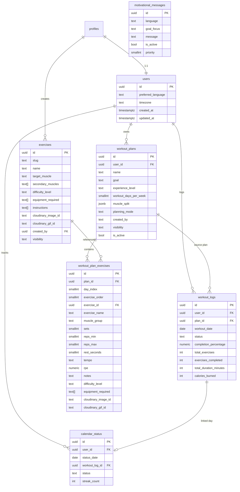

# Workout Planner Module (Production Spec)

## 1) ER Diagram (Mermaid Ready)

## 2) API Structure
- `POST /api/workout-planner/generate` smart plan generation
- `POST /api/workout-planner/manual` manual plan creation
- `GET /api/workout-planner/plans` list owned plans
- `PATCH /api/workout-planner/plans/:id` activate/archive plan
- `POST /api/workout-planner/logs` create/update workout log
- `GET /api/workout-planner/calendar?month=YYYY-MM` monthly statuses
- `PUT /api/workout-planner/calendar` set completed/missed/rest/planned
- `GET /api/workout-planner/exercises` catalog read endpoint
- `GET /api/dashboard/motivation` daily motivation + streak + completion stats

## 3) Smart Planner Logic
- Goal-based intensity presets:
  - `fat_loss`: higher reps, shorter rest
  - `hypertrophy`: moderate reps/rest
  - `strength`: low reps, long rest
- Experience multiplier adjusts sets/reps/rest/RPE.
- Muscle split auto-distribution by selected weekly days.
- Rebalancing avoids heavy overlap on consecutive days.
- Exercises selected from central catalog with difficulty + equipment weighting.

## 4) Security Controls Implemented
- Supabase auth JWT required for every planner endpoint.
- RLS enabled on all planner tables with owner-based and admin policies.
- IDOR prevention: queries are always scoped to current resolved `profileId`.
- DB-backed rate limiting via `consume_rate_limit()` function.
- Input validation/sanitization in `lib/workout-planner/validation.ts`.
- Cloudinary usage stores only asset IDs (`cloudinary_*_id`) in DB.
- Role checks use `admin_emails` + profile role.
- Structured server logging via `lib/server/logger.ts`.

## 5) SQL Run Order
1. `database/workout_planner/001_workout_planner_schema.sql`
2. `database/workout_planner/002_workout_planner_indexes.sql`
3. `database/workout_planner/003_workout_planner_rls.sql`
4. `database/workout_planner/004_workout_planner_grants.sql`
5. `database/workout_planner/005_workout_planner_seed.sql`
6. `database/workout_planner/006_workout_planner_checks.sql`

## 6) Scalability Notes (10k+ Concurrent)
- Keep all planner mutations behind API routes (no client direct writes for sensitive operations).
- Use DB indexes included in `002_workout_planner_indexes.sql`.
- Run periodic `cleanup_expired_rate_limits()` job (e.g., hourly).
- For global scale, move API limiter to Redis/edge KV later while preserving same interface.
- Consider read replicas/caching for exercise catalog and motivational messages.
