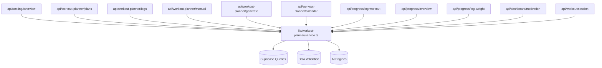

# [service.ts](file:///c:/Users/priya/Desktop/biolift/lib/workout-planner/service.ts) Dependency Graph

The [lib/workout-planner/service.ts](file:///c:/Users/priya/Desktop/biolift/lib/workout-planner/service.ts) file acts as the primary monolithic business layer for the entire application. It sits directly between the API layer and the Supabase database.

## 1. Files Importing [service.ts](file:///c:/Users/priya/Desktop/biolift/lib/workout-planner/service.ts)
The following API Route Handlers explicitly import and depend on [service.ts](file:///c:/Users/priya/Desktop/biolift/lib/workout-planner/service.ts) to function:

*   [app/api/ranking/overview/route.ts](file:///c:/Users/priya/Desktop/biolift/app/api/ranking/overview/route.ts)
*   [app/api/workout-planner/plans/route.ts](file:///c:/Users/priya/Desktop/biolift/app/api/workout-planner/plans/route.ts)
*   [app/api/workout-planner/logs/route.ts](file:///c:/Users/priya/Desktop/biolift/app/api/workout-planner/logs/route.ts)
*   [app/api/workout-planner/manual/route.ts](file:///c:/Users/priya/Desktop/biolift/app/api/workout-planner/manual/route.ts)
*   [app/api/workout-planner/generate/route.ts](file:///c:/Users/priya/Desktop/biolift/app/api/workout-planner/generate/route.ts)
*   [app/api/workout-planner/calendar/route.ts](file:///c:/Users/priya/Desktop/biolift/app/api/workout-planner/calendar/route.ts)
*   [app/api/progress/log-workout/route.ts](file:///c:/Users/priya/Desktop/biolift/app/api/progress/log-workout/route.ts)
*   [app/api/progress/overview/route.ts](file:///c:/Users/priya/Desktop/biolift/app/api/progress/overview/route.ts)
*   [app/api/progress/log-weight/route.ts](file:///c:/Users/priya/Desktop/biolift/app/api/progress/log-weight/route.ts)
*   [app/api/dashboard/motivation/route.ts](file:///c:/Users/priya/Desktop/biolift/app/api/dashboard/motivation/route.ts)
*   [app/api/workout/session/route.ts](file:///c:/Users/priya/Desktop/biolift/app/api/workout/session/route.ts)

## 2. Exported Functions
Below are all the domain-logic functions exported by [service.ts](file:///c:/Users/priya/Desktop/biolift/lib/workout-planner/service.ts). They represent the primary "God Object" operations happening inside the single file:

### Workout Execution & Logging
-   [upsertWorkoutLog()](file:///c:/Users/priya/Desktop/biolift/lib/workout-planner/service.ts#1064-1146)
-   [upsertCalendarStatus()](file:///c:/Users/priya/Desktop/biolift/lib/workout-planner/service.ts#1182-1236)
-   [logManualWorkoutExecution()](file:///c:/Users/priya/Desktop/biolift/lib/workout-planner/service.ts#1865-1982)
-   [isNoWorkoutPlanError()](file:///c:/Users/priya/Desktop/biolift/lib/workout-planner/service.ts#238-241)

### AI & Smart Plans
-   [generateSmartPlan()](file:///c:/Users/priya/Desktop/biolift/lib/workout-planner/service.ts#551-601)
-   [getAiExerciseSuggestions()](file:///c:/Users/priya/Desktop/biolift/lib/workout-planner/service.ts#930-995)
-   [getWorkoutRecommendations()](file:///c:/Users/priya/Desktop/biolift/lib/workout-planner/service.ts#1369-1421)
-   [primeWorkoutRecommendationCache()](file:///c:/Users/priya/Desktop/biolift/lib/workout-planner/service.ts#1422-1453)

### Manual Planning & Exercises
-   [createManualPlan()](file:///c:/Users/priya/Desktop/biolift/lib/workout-planner/service.ts#602-649)
-   [listUserPlans()](file:///c:/Users/priya/Desktop/biolift/lib/workout-planner/service.ts#650-664)
-   [getPlanWithExercises()](file:///c:/Users/priya/Desktop/biolift/lib/workout-planner/service.ts#706-755)
-   [replacePlanExercises()](file:///c:/Users/priya/Desktop/biolift/lib/workout-planner/service.ts#756-851)
-   [updatePlan()](file:///c:/Users/priya/Desktop/biolift/lib/workout-planner/service.ts#1003-1046)
-   [updatePlanStatus()](file:///c:/Users/priya/Desktop/biolift/lib/workout-planner/service.ts#1047-1054)
-   [searchExerciseCatalog()](file:///c:/Users/priya/Desktop/biolift/lib/workout-planner/service.ts#852-883)
-   [createCustomExercise()](file:///c:/Users/priya/Desktop/biolift/lib/workout-planner/service.ts#884-929)

### Dashboard & Analytics
-   [getCalendarMonth()](file:///c:/Users/priya/Desktop/biolift/lib/workout-planner/service.ts#1237-1256)
-   [getMotivationSnapshot()](file:///c:/Users/priya/Desktop/biolift/lib/workout-planner/service.ts#1257-1368)
-   [getDashboardSummary()](file:///c:/Users/priya/Desktop/biolift/lib/workout-planner/service.ts#1477-1626)
-   [getProgressOverview()](file:///c:/Users/priya/Desktop/biolift/lib/workout-planner/service.ts#1627-1836)
-   [logBodyWeightEntry()](file:///c:/Users/priya/Desktop/biolift/lib/workout-planner/service.ts#1837-1864)
-   [refreshLeaderboardForUser()](file:///c:/Users/priya/Desktop/biolift/lib/workout-planner/service.ts#2005-2150)
-   [getRankingOverview()](file:///c:/Users/priya/Desktop/biolift/lib/workout-planner/service.ts#2151-2185)

## 3. Dependency Graph Map

